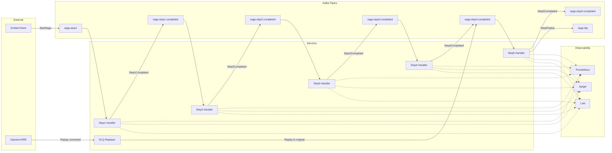

# SAGA Choreography Lab – Detailed Documentation

## 1. Purpose of the System

The **SAGA Choreography Lab** is a hands-on, educational environment designed to help engineers, architects, and DevOps professionals understand how to design, operate, and debug a distributed transaction system built with the **SAGA pattern (choreography style)**.

The system simulates a real-world scenario where multiple services must coordinate through asynchronous events to complete a business transaction. We deliberately include **failure modes** to teach troubleshooting and recovery techniques.

---

## 2. Stakeholders & Their Perspectives

### a) **Engineering & Development Teams**

* Learn how to implement event-driven services in Go.
* Practice designing choreography-based sagas.
* Understand retry, compensation, idempotency, and dead-letter queue (DLQ) patterns.

### b) **Operations & SRE Teams**

* Gain hands-on experience with **observability tooling** (Prometheus, Grafana, Jaeger, Loki).
* Practice debugging distributed failures.
* Learn how to replay failed events safely.

### c) **Product & Business Stakeholders**

* Understand the reliability guarantees of choreography sagas.
* See how failures are contained and resolved.
* Appreciate the trade-offs between simplicity (choreography) and control (orchestration).

---

## 3. High-Level Design (HLD)

### System Overview

The system uses **Kafka** as the central event bus. Each service consumes an event from one topic, processes it, and publishes the result to the next topic. There is no central orchestrator – coordination emerges from the sequence of published events.

### Components

* **Emitter**: Publishes the initial `StartSaga` event into `saga.step1`.
* **Step Services (Step1..Step5)**: Each service performs a step of the saga. They consume from one topic and publish to the next.
* **Step5**: Special service that simulates different failure modes.
* **DLQ Replayer**: Consumes from `saga.dlq` and replays messages after errors are fixed.
* **Kafka**: Provides durability, ordering, and delivery semantics.
* **Observability Stack**: Prometheus + Grafana (metrics), Jaeger (tracing), Loki + Promtail (logs).

### Data Flow

1. **Emitter → Step1**: Emitter sends a `StartSaga` event with a unique `saga_id`.
2. **Step1..Step4**: Each consumes from `<stepN>.completed` topic and produces a `<stepN+1>.completed` event.
3. **Step5**: Processes final step; can succeed or fail.
4. **Failures**:

   * Retryable errors → retried automatically.
   * Fatal errors → event is published to `saga.dlq`.
5. **DLQ Replayer**: Reads from DLQ, repairs/resubmits messages.

### Message Format

```json
{
  "saga_id": "UUID",
  "step": 4,
  "schema_version": 1,
  "ts": "RFC3339",
  "payload": { "demo": "anything" }
}
```

### Design Decisions

* **Choreography (vs Orchestration)**: Selected for simplicity and autonomy. Each service knows only its predecessor and successor.
* **Idempotency**: All consumers are designed to handle duplicate messages safely.
* **DLQ**: Essential for poison messages and ensuring no data is lost.
* **Observability**: Integrated from the start to make failures visible and diagnosable.

### HLD Diagram (Conceptual)

```
   ┌─────────┐      ┌─────────┐      ┌─────────┐      ┌─────────┐      ┌─────────┐
   │ Emitter │──▶──│ Step 1  │──▶──│ Step 2  │──▶──│ Step 3  │──▶──│ Step 4  │
   └─────────┘      └─────────┘      └─────────┘      └─────────┘      └─────────┘
                                                                        │
                                                                        ▼
                                                                   ┌─────────┐
                                                                   │ Step 5  │
                                                                   └─────────┘
                                                                        │
                                    ┌───────────────┐                   │
                                    │ DLQ Replayer │◀───saga.dlq◀──────┘
                                    └───────────────┘
```

---

## 4. Sample Data Flow Diagram (DFD)

The following Data Flow Diagram (DFD) shows how data moves step by step:

```
+-------------+         +----------+         +----------+         +----------+         +----------+
|   Emitter   |  -->   |  Step 1  |  -->   |  Step 2  |  -->   |  Step 3  |  -->   |  Step 4  |
+-------------+         +----------+         +----------+         +----------+         +----------+
                                                                                         |
                                                                                         v
                                                                                   +----------+
                                                                                   |  Step 5  |
                                                                                   +----------+
                                                                                         |
       +---------------------------------------------------------------------------------+
       |                                                                                 |
       v                                                                                 v
+-----------------+                                                               +---------------+
|  Kafka Topics   |                                                               |   DLQ Topic   |
+-----------------+                                                               +---------------+
```

### Step-by-Step Explanation

1. **Emitter** creates a `StartSaga` event and sends it to Kafka (`saga.step1`).
2. **Step1 service** consumes the event, processes it, and publishes `saga.step1.completed`.
3. **Step2 service** consumes `saga.step1.completed` and publishes `saga.step2.completed`.
4. **Step3 service** consumes `saga.step2.completed` and publishes `saga.step3.completed`.
5. **Step4 service** consumes `saga.step3.completed` and publishes `saga.step4.completed`.
6. **Step5 service** consumes `saga.step4.completed` and:

   * On success → publishes `saga.step5.completed`.
   * On retryable failure → reprocesses until success or intervention.
   * On fatal failure → sends the event to `saga.dlq`.
7. **DLQ Replayer** consumes from `saga.dlq`, applies fixes (if needed), and replays events back into Kafka.

This DFD highlights how events flow in the system, where failures can occur, and how data recovery is handled.

---

## 5. Failure Simulation & Learning

### Configurable failure modes for **Step 5**:

* `none`: Always succeed.
* `retryable`: Returns transient errors to test retry handling.
* `fatal`: Sends message to DLQ, simulating schema or validation errors.
* `flaky:<p>`: Introduces random failures with probability `p`.

This allows stakeholders to:

* Observe retry storms.
* Inspect DLQ behavior.
* Practice manual replay of failed messages.
* Learn how retries and DLQs impact throughput and lag.

---

## 6. Observability & Debugging Tools

### Metrics (Prometheus)

* `saga_step_latency_seconds{step}` – latency histograms.
* `saga_retries_total{step,reason}` – retry counters.
* `dlq_messages_total{topic}` – DLQ traffic.

### Dashboards (Grafana)

* **SAGA Choreography Lab**:

  * DLQ rate.
  * Retries by reason.
  * Step throughput.
  * Step 5 latency (p95).
* **SAGA Logs & Traces**:

  * Real-time logs for `step5` and DLQ replayer.
  * Drill down into specific saga IDs.

### Tracing (Jaeger)

* End-to-end trace per `saga_id`.
* View spans for consume → handle → produce.
* Correlate retries and DLQ events with logs.

### Logs (Loki + Promtail)

* Aggregated logs for each service.
* Search by `app=step5` or `saga_id`.
* Identify errors, retries, compensations.

---

## 7. Hands-On Labs

### Lab 1: Retry Storms

* Configure Step 5 with `FAIL_MODE=retryable`.
* Watch retries spike in Grafana.
* Inspect consumer lag and Jaeger traces.

### Lab 2: Fatal Failures & DLQ

* Configure Step 5 with `FAIL_MODE=fatal`.
* Observe messages routed to `saga.dlq`.
* Inspect DLQ messages with `kubectl` or Kafka CLI.

### Lab 3: Replay from DLQ

* Stop failures (`FAIL_MODE=none`).
* Deploy DLQ replayer.
* Replay messages back into the pipeline safely.

### Lab 4: Ordering Bug Simulation

* Modify Step 3 to use random Kafka keys.
* Observe out-of-order handling.
* Revert fix and restore ordering by `saga_id`.

---

## 8. Deployment Setup

* Runs on **Minikube** with **Helm charts** for Kafka, Prometheus, Grafana, Jaeger, and Loki.
* Docker images built for each service.
* K8s manifests provided for deployments, topics, service monitors, and dashboards.
* Makefile simplifies `make up`, `make down`, `make grafana`, `make jaeger`, `make loki`.

---

## 9. Benefits to Stakeholders

### For Engineers

* Practical exposure to event-driven design.
* Debugging experience in distributed sagas.

### For SRE/Operations

* Learn monitoring strategies.
* Handle retries, DLQs, lag, and schema mismatches.

### For Product Stakeholders

* Understand how reliability is achieved.
* Build confidence in scaling distributed systems.

---

## 10. Key Takeaways

* **Choreography** gives autonomy but requires strong observability.
* **Retries** must be bounded and monitored.
* **DLQ** is essential for poison message handling.
* **Correlation IDs** (`saga_id`) link logs, metrics, and traces.
* Hands-on labs accelerate team learning.

---

## 11. Next Steps

* Integrate more realistic business logic into steps.
* Add compensation flows (rollback events).
* Extend labs to cover scaling and failover scenarios.
* Explore orchestration (e.g., Temporal) for comparison.

---

**This SAGA Choreography Lab is a shared sandbox for learning, experimenting, and mastering distributed transactions in microservices.**

## 11. Sample Data Flow Diagram (DFD) with Step‑by‑Step Explanation

### 11.1 DFD Level‑0 (Context Diagram)

Represents the SAGA Choreography Lab as a single logical system, its external entities, and major data stores/flows.

```
[External Entity]
  Client/Tester (Emitter CLI/UI)
        │  (StartSaga request)
        ▼
┌───────────────────────────────┐
│  P0: SAGA Choreography System │
│  (K8s + Go services + Kafka)  │
└───────────────────────────────┘
   │                 │
   │ (metrics)       │ (traces)
   ▼                 ▼
 D3: Prometheus   D4: Jaeger
   │
   │ (logs)
   ▼
 D5: Loki
   ▲
   │ (DLQ replay cmd)
   │
[External Entity]
   Operator/SRE
```

**Data Stores (logical):**

* **D1 Kafka Topics (Event Bus)**: `saga.step1`, `saga.step1.completed`, …, `saga.step5.completed`
* **D2 Dead‑Letter Queue (DLQ)**: `saga.dlq` (poison/irrecoverable messages)
* **D3/D4/D5 Observability**: Prometheus (metrics), Jaeger (traces), Loki (logs)

**External Entities:**

* **Client/Tester**: Triggers sagas via the **Emitter** service
* **Operator/SRE**: Observes dashboards, inspects DLQ, triggers replays

---

### 11.2 DFD Level‑1 (Decomposition of P0)

Breaks the system into concrete processes (services), topics (data stores), and flows.

```
External: Emitter (Client/Tester)
     │ 1. StartSaga (saga_id)
     ▼
D1.1: saga.step1  ───────────────────────────────────────────────────────┐
     ▲                                                                   │
     │ 2. consume                                                        │
P1: Step1 Handler  ── 3. Step1Completed ──▶  D1.2: saga.step1.completed  │
                                                                      ◀─┘
                                   ▲ 4. consume
                                   │
P2: Step2 Handler  ── 5. Step2Completed ──▶  D1.3: saga.step2.completed
                                   ▲ 6. consume
                                   │
P3: Step3 Handler  ── 7. Step3Completed ──▶  D1.4: saga.step3.completed
                                   ▲ 8. consume
                                   │
P4: Step4 Handler  ── 9. Step4Completed ──▶  D1.5: saga.step4.completed
                                   ▲ 10. consume
                                   │
P5: Step5 Handler  ── 11a. Step5Completed ─▶ D1.6: saga.step5.completed
                  └── 11b. Step5Failed ────▶ D2: saga.dlq (with x-original-topic)

P6: DLQ Replayer  ◀── 12. consume DLQ (filter by saga_id) 
                  └── 13. replay to original topic (e.g., D1.5 saga.step4.completed)
```

**Notes:** All messages are **keyed by `saga_id`** to preserve per‑saga ordering across partitions. Observability (metrics, traces, logs) is emitted at each process.

---

### 11.3 Data Dictionary (key flows & stores)

* **Flow F1: StartSaga**

  * *From*: Emitter → D1.1 `saga.step1`
  * *Shape*: `{ saga_id, step=1, schema_version, ts, payload }`
* **Flow F2..F6: StepNCompleted**

  * *From*: StepN → D1.(N+1) `saga.stepN.completed`
  * *Semantics*: Successful completion and handoff trigger for Step N+1
* **Flow F7: Step5Failed**

  * *From*: Step5 → D2 `saga.dlq`
  * *Headers*: `x-saga-id`, `x-original-topic`
  * *Semantics*: Fatal/poison message, requires intervention
* **Flow F8: Replay**

  * *From*: DLQ Replayer → original topic (from header or configured)
  * *Semantics*: Safe, scoped reprocessing after a fix
* **Store D1: Kafka Topics** – Canonical event history per step (immutable log)
* **Store D2: DLQ** – Parking lot for poison events
* **Store D3/D4/D5** – Metrics (Prometheus), Traces (Jaeger), Logs (Loki)

---

### 11.4 Step‑by‑Step Explanation (Happy & Failure Paths)

1. **Emit StartSaga**: Emitter produces `StartSaga` to `saga.step1` (key = `saga_id`).
2. **Step1 consume→process→produce**: Step1 consumes `saga.step1`, does work, emits `saga.step1.completed`.
3. **Step2..Step4 cascade**: Each step repeats the consume→process→produce cycle, moving the saga forward.
4. **Step5 decision**: Step5 handles the event from `saga.step4.completed` and decides outcome based on **FAIL\_MODE**:

   * `none` → produce `saga.step5.completed` (terminal success).
   * `retryable`/`flaky:p` → return transient error; consumer retries (bounded/backoff); metrics increment `saga_retries_total`.
   * `fatal` → publish to `saga.dlq` with `x-original-topic` set to `saga.step4.completed`.
5. **Observability on every step**:

   * **Metrics**: record latency, retries, DLQ counters.
   * **Tracing**: span for consume/handle/produce with `saga_id` attribute.
   * **Logs**: structured line with `saga_id`, error category, headers.
6. **Operator actions** (failure case): Investigate DLQ message (payload + headers), deploy code/config fix (e.g., schema adapter), then **stop failure mode**.
7. **Replay**: DLQ Replayer reads `saga.dlq` (optionally filtering by `saga_id`), re‑emits the original message to `x-original-topic` to resume processing at Step5.
8. **Idempotency guards**: Replays are safe because handlers are idempotent and/or use unique keys to prevent duplicate effects.
9. **Completion**: Processing proceeds to `saga.step5.completed`. Dashboards show retries/latency back to normal.

---

### 11.5 Mermaid Diagram (DFD‑style view)

> *If your viewer supports Mermaid, the following renders as a diagram.*



---

### 11.6 Why this DFD matters

* Clarifies **where data lives** (Kafka topics, DLQ) vs **who transforms it** (step handlers).
* Makes **control‑flow vs data‑flow** explicit in a choreography, helping stakeholders reason about retries, DLQ, and replay.
* Serves as a **runbook map** during incidents: find the topic, the consumer group, and the emitting service quickly.

